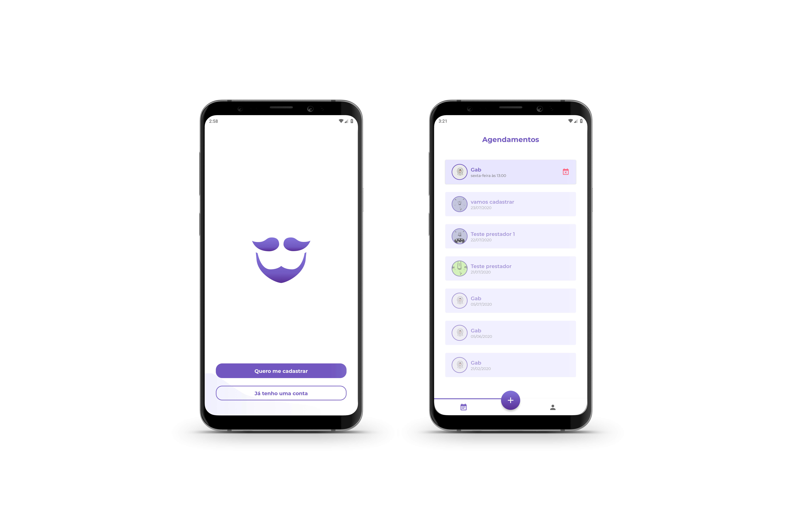

Este projeto faz parte da trajetória do Bootcamp GoStack da Rocketseat. Nela aplicamos conhecimentos adquiridos durante os módulos, esta é uma aplicação completa (back-end, front-end web e front-end mobile).

# :mag: Sobre o desafio

O projeto consiste em uma aplicação onde prestadores de serviços de beleza poderão se cadastrar e receber agendamentos de clientes, que também poderão se cadastrar na aplicação, porém em sua versão mobile.

# :bookmark_tabs: Sumário

<a href="./gobarber-api">Backend</a>
<a href="./gobarber-web">Web</a>
<a href="./mobile">Mobile</a>

# :satellite: Tecnologias utilizadas

* Backend: <a href="https://nodejs.org/en/docs/">Node.js</a>
* Web: <a href="https://pt-br.reactjs.org/">ReactJS</a>
* Mobile: <a href="https://reactnative.dev/">React Native</a>

 
<blockquote>Made with :coffee: and :black_heart: by Gab</blockquote>
